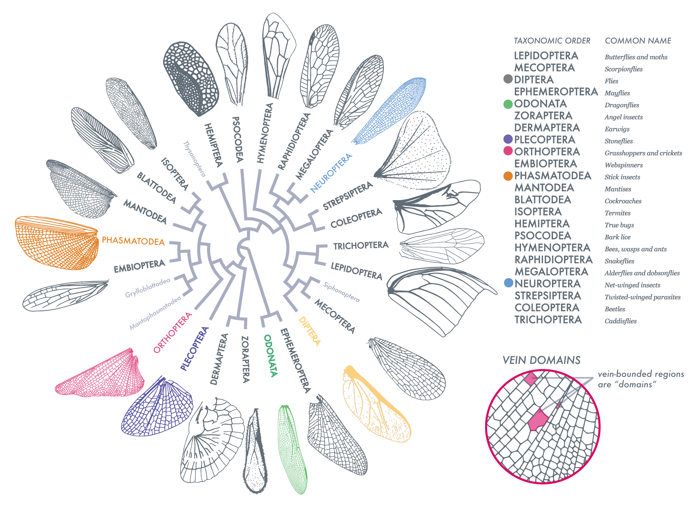
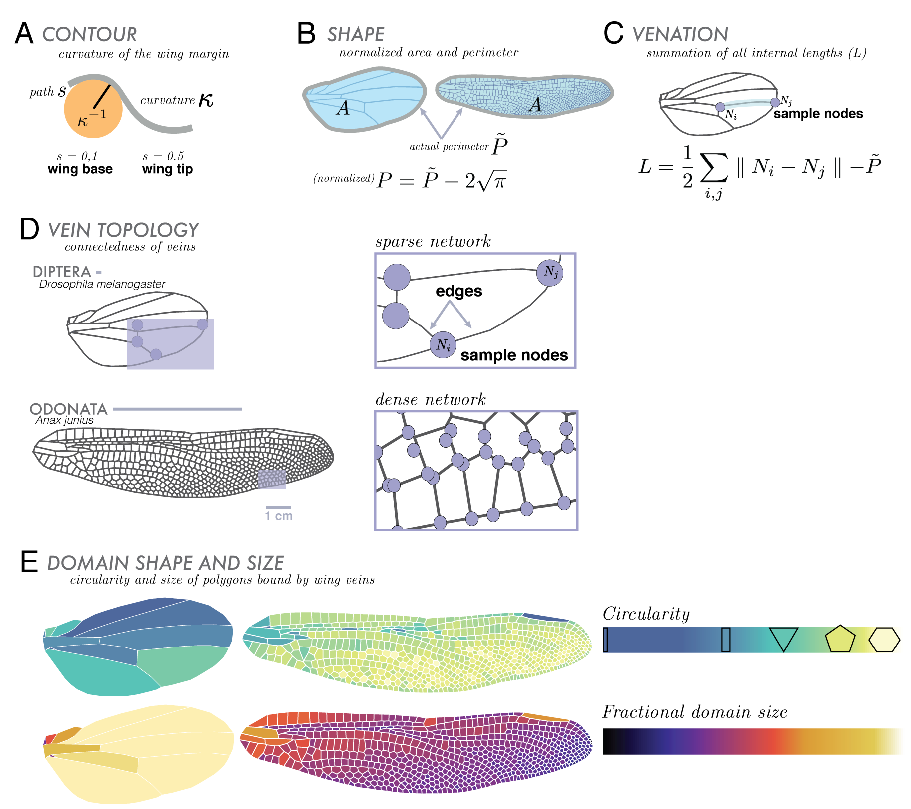
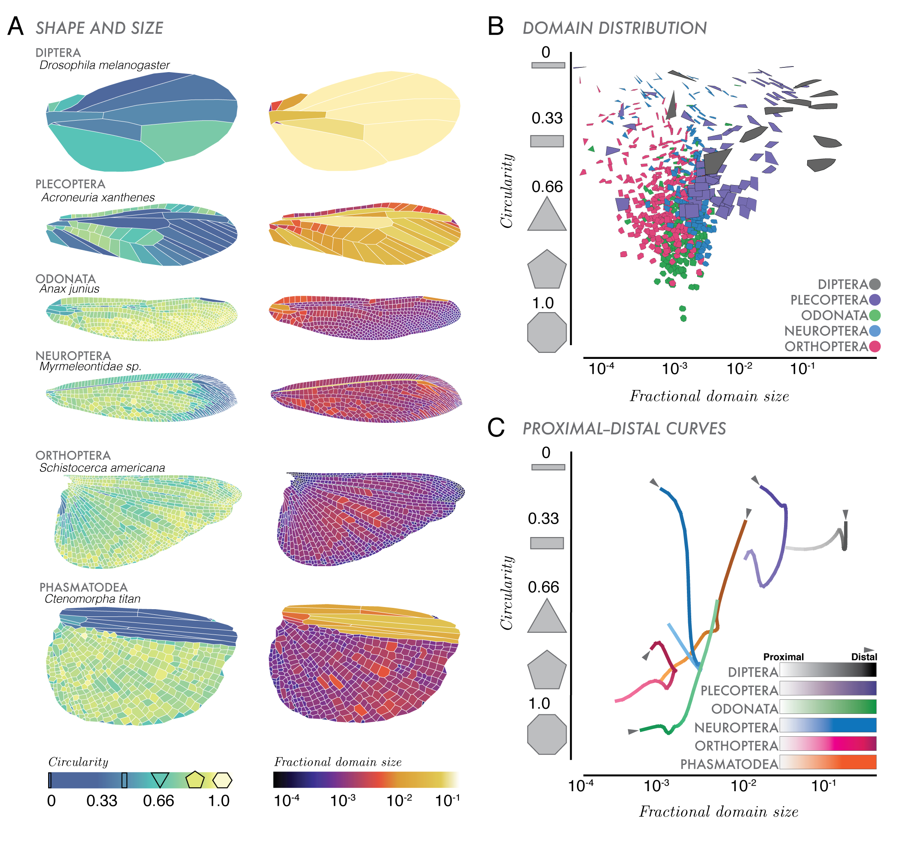
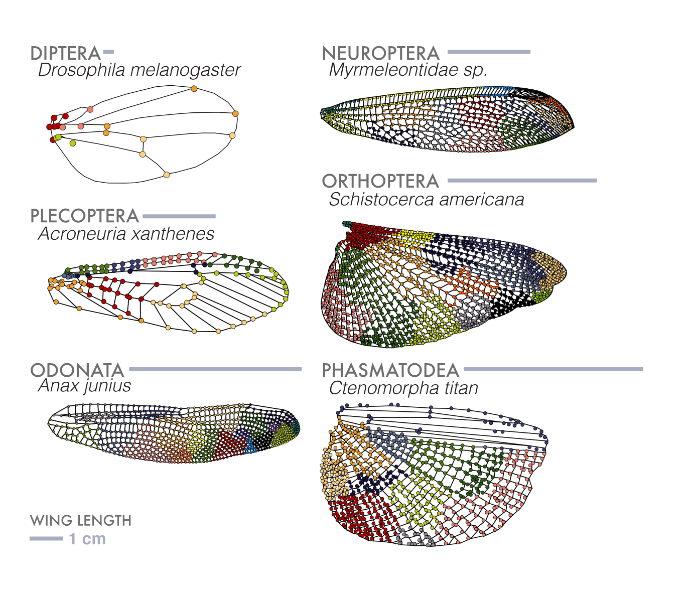

# Size and shape of insect wings
Code accompanying "Size, shape and structure of insect wings" by M. Salcedo, J. Hoffmann, S. Donoughe, and L. Mahadevan.

bioRxiv Link:
https://www.biorxiv.org/content/early/2018/11/26/478768
## File formats
Folders have segmented wing images.  Note, some folders, such as *plecoptera* are rather large when unzipped (~800 MB).
More data can be found at:
https://github.com/hoffmannjordan/insect-wing-venation-patterns

## Segmentation Code
The python scripts. There are a few similar repositories that have similar code. For example, for segmentation a 
more comprehensive code exists at: https://github.com/hoffmannjordan/Fast-Marching-Image-Segmentation
and for some wing statistics, code can be found at https://github.com/hoffmannjordan/insect-wing-venation-patterns.
All code provided has been tested in python 2.7. Python 3 should be a very minor port, mainly reformatting some print
statements.

## Analysis Code
There is a _Mathematica_ notebook that will do the analysis of the segmented files. The _Mathematica_ code always uses
a segmented csv file.

## Article Description
Insect wings are incredibly diverse in their complexity, vary greatly in size, and also greatly in function. 
In this work, we perform a comprehensive analysis of wings of many shapes and sizes where we have removed all aspects
of scale and focus entirely on geometric arrangements.

Along with our code, we also release all of our data to facilitate future analysis. We perform a suite of geometric analyses, detailed in the figure below. We study geometric aspects of the wing in a heirachical fashion, focusing on the contour of the wing, on the internal veination of the wing, and the shape of domains in an insect wing,

For each wing, we can compute various properties of the exterior and interior of the wing. We compute the absolute 
value of curvature moving in a clockwise direction around the wing. We also looked at how the amount of veination
on the perimiter of the wing compares to the amount of internal veination. We renormalize these axis so that we can
ask how the shape of the wing compares to how dense its internal veination is.

Next, we looked at the P--D curves, as described in Hoffmann _et. al._ PNAS (2018). Sweeping across the P-D axis of a wing, we compute the mean size and circularity of the domains in a thin rectangular slice. We plot this trajectory 
as it highlights how domains vary spatially along the long axis of the wing.

We employ a suite of network analysis tools on our veination pattern. Future work may explore further in relationship 
between the detected clusters and biological properties.
